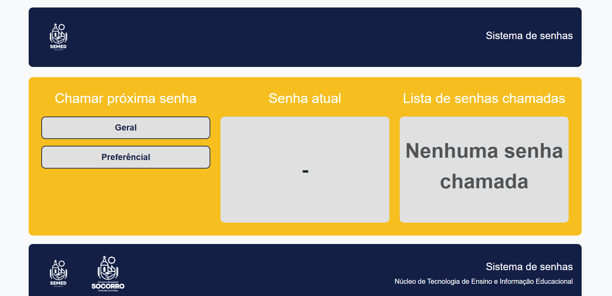

# **Sistema de senhas - SEMED**
#### Este repositório contém o código-fonte do Sistema de Senhas, um projeto desenvolvido para gerenciar filas de atendimento de forma organizada e eficiente.

### <a href="" target="_blank">Teste o sistema</a>

# 📌 Funcionalidades

Chamada de senhas de atendimento em duas categorias: Geral e Preferencial.

Exibição da senha atual em atendimento.

Listagem das senhas chamadas anteriormente.

Interface intuitiva para melhor experiência do usuário.

# 🛠️ Tecnologias Utilizadas

# 
# **Obrigado! 😎😁**
